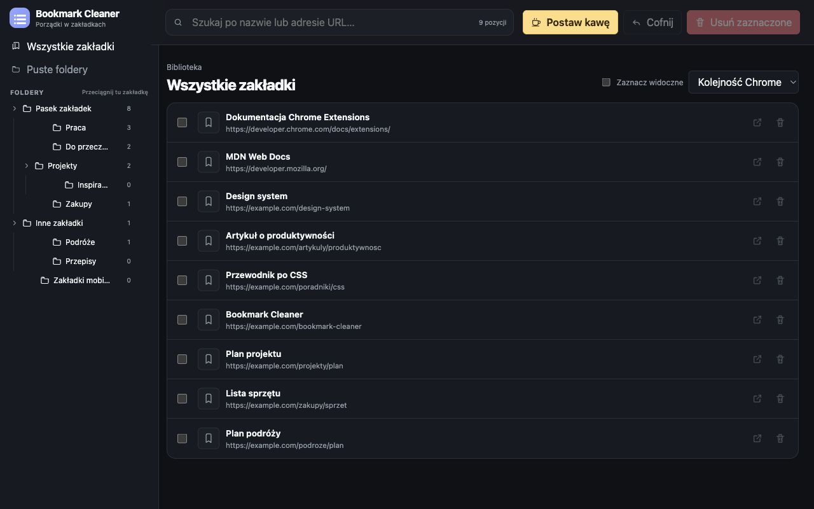

# Bookmark Cleaner

Przeglądaj, porządkuj i usuwaj zakładki Chrome w jednym widoku. Rozszerzenie działa lokalnie; zakładki nie są przesyłane na serwer.

## Funkcje

- Drzewo folderów, wyszukiwanie po nazwie i adresie oraz widok pustych folderów.
- Przenoszenie zakładek i folderów do innych folderów metodą przeciągnij i upuść.
- Zaznaczanie wielu elementów, usuwanie i cofnięcie ostatniej operacji.
- Sortowanie i tryb ciemny zgodny z ustawieniem systemu.

## Instalacja lokalna

1. Pobierz repozytorium lub archiwum ZIP i rozpakuj je.
2. Otwórz `chrome://extensions` i włącz tryb deweloperski.
3. Kliknij **Załaduj rozpakowane** i wybierz katalog zawierający `manifest.json`.
4. Kliknij ikonę rozszerzenia, aby otworzyć menedżer w nowej karcie.

Uprawnienie `bookmarks` służy do odczytu i modyfikacji zakładek. Uprawnienie `storage` przechowuje lokalnie ostatnią usuniętą partię do cofnięcia. Szczegóły: [Prywatność](PRIVACY.md).

## Wsparcie

[Buy Me a Coffee](https://buymeacoffee.com/osakwojcie1) · Zgłaszanie problemów: GitHub Issues.
